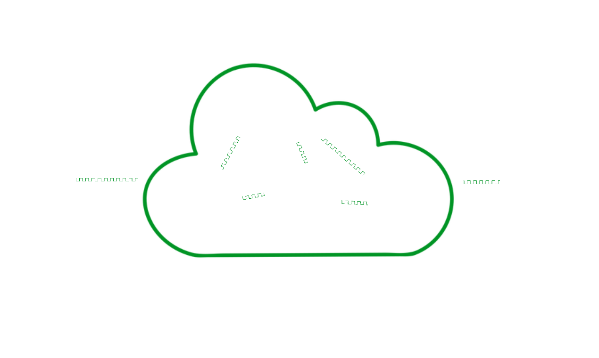

# Components

## Gateway

The gateway is the entry point component of the request. All requests go through the gateway, which acts as a proxy and can be configured with the -x option of the curl command or a windows proxy configuration. The gateway receives a list of nodes from the node pool at start-up. It also refreshes the list periodically during execution. When gateway receives a request, it randomly selects few nodes from the list of nodes and decides on the routing. The number of the nodes called "hops". It then encrypts the payload in the reverse order of the routing as in the Tor protocol and passes the request to the first node. The results are received in the reverse order.

## Node

Nodes are components of the Negy network. Their role is to deliver received requests to the next component or arrival point, the server, and also to send the results in the reverse order The large number of nodes directly contributes to network stability and security. Nodes are operated by Negy officially, but external contributions are most effective. Users with spare resources are encouraged to join the Negy network.

## Node pool

Node pool is the component that manages nodes. Every node joins the network by connecting to a specific node pool, which has three main roles: first, as described earlier, it acts as an endpoint for nodes to join the network. The second role is to ensure that the node is running normally. It performs periodic health checks and updates its list. Finally, there is the role of passing the list of nodes to the gateway.
