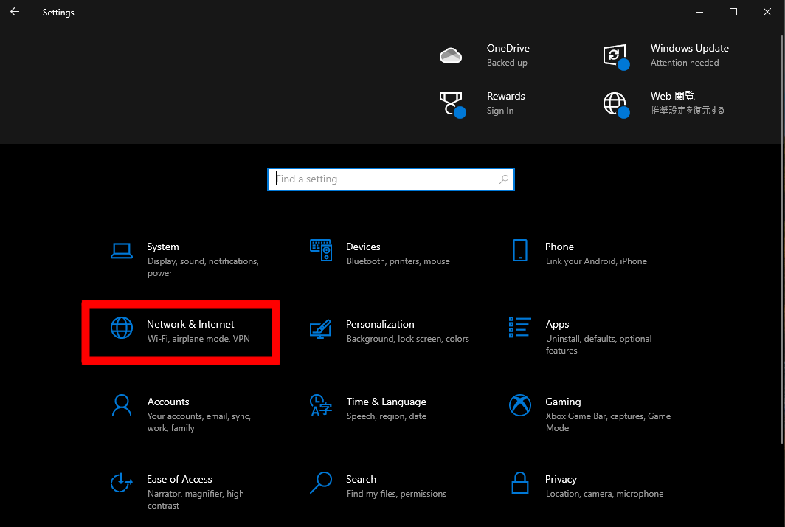
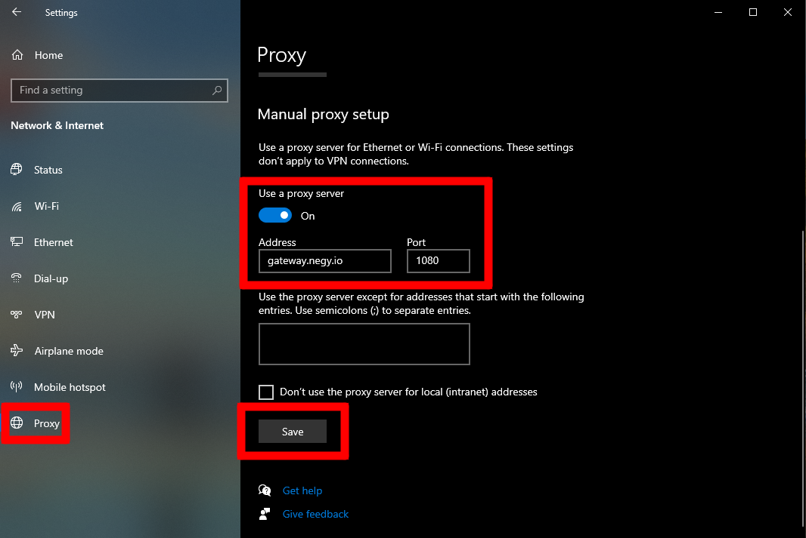

:::caution
Currently the public endpoint was closed. The configuration below would not work.
If you want to try Negy, create your own network.
See [Create full Negy network on your local pc](/docs/contribution/development_contribution.md)
:::

# Configure on Windows

Simply add proxy setting on your Windows PC. Open Windows Setting and find "Network & Internet".

Open proxy setting and enable it. Input "gateway.negy.io" for address and "1080" for port number.

Save it!

Try browsering some contents on your browser. Enjoy!
